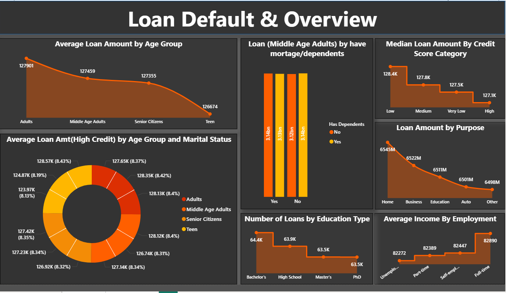
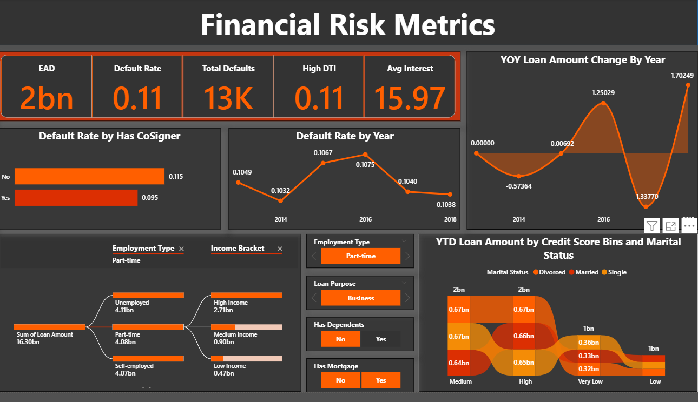

# 📊 Credit Risk Assessment Dashboard (Power BI)

---

## 📌 Project Overview

This project presents an interactive Power BI dashboard designed to assess borrower credit risk and analyze loan default trends using financial and demographic data.

The dashboard provides risk-focused KPIs, borrower segmentation, financial exposure analysis, and time-based default trend evaluation to support data-driven lending decisions.

---

## 📁 Repository Contents

- Credit_Risk_Dashboard.pbix – Power BI dashboard file  
- Loan_data.xlsx – Dataset used for analysis  
- screenshots/ – Dashboard preview images
- Column_Definitions.xlsx - Column defination for the dataset

---

## 📈 Key Metrics Displayed

- Total Loans Issued  
- Total Defaults  
- Default Rate  
- High DTI Default Rate  
- Exposure at Default (EAD)  
- Average Interest Rate (Defaulted Borrowers)  

---

## 🔍 Business Insights Provided

- Default rate across credit score categories  
- Risk posed by borrowers with high debt-to-income ratio  
- Impact of co-signer presence on loan default probability  
- Financial exposure across loan purposes  
- Employment stability vs default likelihood  
- Interest rate pricing for high-risk borrowers  
- Time-based lending risk trends (Vintage Analysis)  

---

## 📊 Dashboard Features

### 1️⃣ Credit Risk Overview
- Default Rate by Credit Score Band  
- Default Rate by DTI Bucket  
- Default Rate by Employment Stability  
- Default Rate by Loan Purpose  

---

### 2️⃣ Financial Exposure Analysis
- Exposure at Default (EAD) by Loan Purpose  
- Defaults by Mortgage Availability  
- Default Rate by Co-Signer Presence  
- Interest Rate vs Credit Score (Risk Pricing Check)  

---

### 3️⃣ Time-Based Risk Analysis
- Default Rate by Loan Year  
- EAD Trend by Loan Year  

---

### 4️⃣ Interactive Filtering
- Employment Type slicer  
- Loan Purpose slicer  
- Mortgage Availability slicer  
- Co-Signer slicer  

---

## 📊 Dashboard Preview

### Credit Risk Overview

---

###  Risk Analysis

---

## 🛠 Tools & Techniques Used

- Power BI  
- DAX  
- Data Modeling  
- Financial Risk Segmentation  
- KPI Design  
- Interactive Report Design  

---

## 🎯 Project Outcome

This dashboard demonstrates the ability to transform borrower loan data into structured financial risk insights by identifying high-risk customer segments contributing to increased probability of default and financial exposure.
